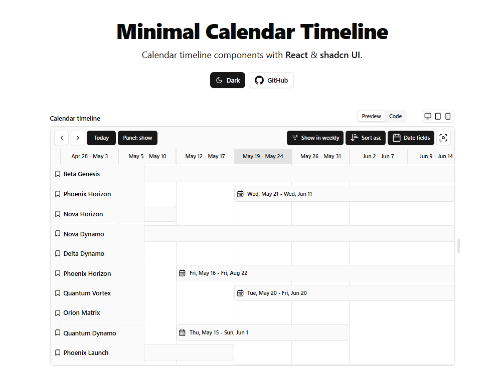

# Minimal Calendar Timeline



## Installation

1. Install the required dependencies:

```bash
npm install date-fns react-dnd react-dnd-html5-backend
```

2. Copy and paste the following code into your project:

[src/components/calendar-timeline.tsx](./src/components//calendar-timeline.tsx)

## Dependencies

The following Shadcn UI components are required:
- [ScrollArea](https://ui.shadcn.com/docs/components/scroll-area)

## Usage
```tsx
import {
    useTimeline,
    TimelineProvider,
    TimelineControl,
    TimelineContent,
    TimelineHeader,
    TimelineRows
} from '@/components/calendar-timeline';

function Component() {
  const timeline = useTimeline({
    // configuration here...
  });

  return (
    <TimelineProvider context={timeline}>
      <TimelineControl>
        {/* your action controls */}
      </TimelineControl>
      <TimelineContent className='max-h-[30rem]'>
          <TimelineHeader />
          <TimelineRows />
      </TimelineContent>
  </TimelineProvider>
  )
}
```

### [More Example](./public/example-code.tsx)

## License

This project is licensed under the MIT License. See the [LICENSE](LICENSE) file for details.